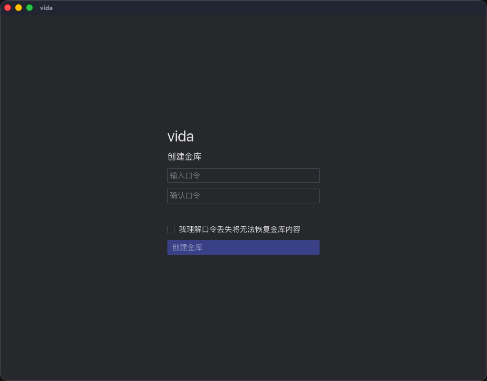

# vida

**加密金库 + 主机管理，正在长成一个 AI Agent 可直接操作的终端。**

vida 解决两个问题：

1. **主机凭据安全**：所有 SSH 主机、口令、私钥存进一个 age 加密的金库（`vault.age`），
   标准 `age` CLI 即可解密，支持本地文件夹同步（Dropbox/Syncthing 友好）。
2. **让 AI Agent 直接操作你的主机（规划中，M5）**：将内置 MCP 服务端，
   让 AI 编码助手（Claude Code、Cursor 等）可以通过 MCP 协议读写金库、连接主机，
   无需把凭据喂给任何第三方。

## 当前状态

**早期开发中。** 已实现：加密金库、本地路径同步、主机管理界面、
**本地终端核心（M2a）**以及**可交互终端 GUI（M2b-2）**——PTY 会话、
二进制增量推送、GPU 渲染、键盘/IME/安全粘贴和窗口 resize。
规划中：终端标签页整合（M2b-3）、SSH 终端（M3）、会话恢复（M4）、MCP 服务端（M5）。

## 截图



## 特性

已实现：

- 🔐 **age 加密金库**：scrypt KDF（log_n=18），可用标准 `age` CLI 解密验证
- 🗝️ **系统钥匙串集成**：可选记住主口令（Keychain）
- 🔄 **本地路径同步**：Dropbox / Syncthing / iCloud 文件夹同步，带冲突检测
- 🖥️ **Tabby 风格界面**：标签页 + 快速连接面板 + 搜索
- 🌐 **多语言**：中文 / English，跟随系统语言
- 🔒 **凭据保护**：口令显示 15 秒自动隐藏，复制 45 秒后自动清除剪贴板
- 🖥️ **本地终端核心（daemon 侧，M2a）**：PTY 会话管理、alacritty Term
  状态维护、二进制推送协议（damage 增量 + RLE）、60fps 限频 + 有界
  通道、`vida-term-test` CLI 验收工具
- ⌨️ **可交互终端 GUI（M2b-2）**：iced/wgpu 实时渲染、键盘与控制键、
  中文 IME Commit、多行 bracketed paste、物理像素行列计算与 PTY resize

规划中：

- 🗂️ **终端标签页整合**（M2b-3）：从主机/快速连接入口打开正式终端标签
- 🤖 **MCP 服务端**（M5）：AI Agent 通过 stdio↔WebSocket 桥接访问金库与主机
- 🔗 **SSH 终端**（M3）

## 安全说明（重要）

**项目处于早期开发阶段，未经第三方安全审计。不建议存放生产环境关键凭证。**

### 威胁模型

**保护什么：**
- 文件被拷贝走：无主口令无法解密金库内容
- 云盘服务商：同步文件夹中的密文不可读
- 口令缓存：仅显式勾选时写入系统钥匙串

**不保护什么：**
- 主机数据（名称/地址/端口/用户名）在金库解密后可见 ——
  金库文件本身是加密的，但解密后这些字段不额外加密
- 已解锁状态：金库内容驻留内存，具备本机权限的进程理论可读取
- 主口令丢失：数据永久丢失，无后门、无恢复通道
- 本机恶意软件：攻击者获得你的用户级权限后，可读取解锁后的内存

### 安全措施（具体做法，非绝对保证）

- 密码与私钥内容永不写入日志
- 敏感字段使用 zeroize 在 drop 时清零
- 金库写入采用原子写入 + fsync，避免半写状态
- `daemon.token`（WebSocket 认证）权限 0600

详细说明见 [SECURITY.md](SECURITY.md)。漏洞上报请走
[GitHub Security Advisory](https://github.com/robertshaqueen-cyber/vida/security/advisories/new)，
不要使用公开 Issue。

## 架构

```
vida (GUI)  ──WebSocket──▶  vida-daemon (金库/同步)
                              │
                              └── 金库 (vault.age, age 加密)

AI Agent ──MCP stdio(规划 M5)──▶ vida-mcp-cli ──WebSocket──▶ vida-daemon
SSH/PTY 终端（规划 M2-M3）
```

- **vida-core** — 金库、加密、同步、多语言（纯逻辑库）
- **vida-daemon** — 守护进程：WebSocket 服务端、协议路由、状态管理
- **vida-gui** — iced + wgpu 原生界面
- **vida-mcp-cli** — stdio→WebSocket 桥接（给只支持 stdio 的 MCP 客户端）

## 构建与运行

**前置依赖：**

- Rust 工具链（stable）
- `age` CLI —— 互操作测试（`age_cli_interop`）会真实调用标准 age
  解密金库，验证「软件停止维护后数据仍可用标准工具解密」
- `expect` —— age CLI 的交互式口令提示需要 TTY，测试用 expect 驱动

```bash
# macOS
brew install age expect

# 构建
cargo build --release

# 启动 daemon（第一个终端）
cargo run --bin vida-daemon

# 启动 GUI（第二个终端）
cargo run --bin vida

# 运行测试（需要 age + expect）
cargo test --workspace
```

> 没有安装 age/expect 时，`age_cli_interop` 测试会**失败**（而不是跳过）——
> 这是有意为之：该测试是设计铁律「金库必须可用标准 age CLI 解密」的唯一验证。

## M2b-2 手动验收

启动 daemon 和 GUI，解锁后点击顶部「▮_」终端按钮：

1. 点击终端画面，输入 `echo hello` 并按 Enter → 预期看到 `hello`。
2. 输入 `sleep 30`，按 Ctrl+C → 预期立即回到 shell 提示符。
3. 按方向键上再按 Enter → 预期重新执行上一条命令。
4. 从其他应用复制两行中文命令，回到终端按 Cmd+V（Linux/Windows 为 Ctrl+Shift+V）
   → 预期两行只进入编辑缓冲区，不立即执行；按 Enter 后才执行。
5. 切换中文输入法，在终端输入中文并确认候选 → 预期中文进入命令行，候选窗位置跟随光标。
6. 调整窗口大小，再执行 `stty size` → 预期行列数随窗口改变，文字不拉伸、不裁切。
7. 点击「返回」→ 预期回到原主界面，不会在数秒后自动跳回终端。
8. 回到终端提示符静止两秒 → 预期当前输入位置的实心方块光标每 500ms 明暗切换。
9. 执行 `ls` 查看中文文件名 → 预期中文字形保持正常宽高比，不被横向拉扁；
   连续输出多行时各行互不遮盖；默认内置 JetBrains Mono 13pt（不是 13px）的行高约 18px，
   普通中文不呈现粗体，英文笔画完整，灰度抗锯齿和密度接近 Ghostty。
10. 返回主界面，进入「设置 → 终端」→ 预期字体和字号都是下拉选择；字体列表含
    内置 JetBrains Mono 与系统安装的等宽字体。修改任一项并保存，再打开终端 → 预期新设置生效；
    重启 Vida 后仍保持。
11. 在调试终端点击顶部已有标签或右上角设置 → 预期退出临时终端并显示所点页面，
    不会继续被调试终端覆盖。

## 开发文档

- [内存指标与验收清单](docs/development.md)
- [GUI 屏幕清单](docs/screens.md)
- [技术决策](docs/decisions.md)

## License

[MIT](LICENSE)
